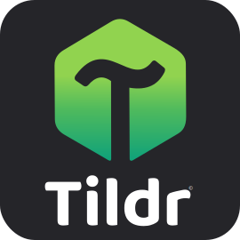

<!-- markdownlint-disable MD033 -->
<!-- markdownlint-disable MD041 -->

  

<h2 align="center">Manage and reproduce your HOME directory declaratively.</h2>

---

## Introduction

**Manage, reproduce, and control your entire `$HOME`—declaratively.**

> **More powerful than *stow*. Simpler than *chezmoi*.**

**Tildr** is a fast, minimalist CLI for defining and reproducing your personal Unix environment.

Rather than manually copying dotfiles, syncing directories, or rebuilding your setup from memory, you describe the desired state of your `$HOME` in a declarative configuration. Tildr then ensures your system converges to that state safely and consistently.

Designed around simplicity, predictability, and idempotency, Tildr helps you keep your environment reproducible across new machines, reinstalls, and everyday changes.

---

## Why Tildr?

Traditional dotfile managers reproduce files. **Tildr** manages your **HOME state**.

Most dotfile managers treat your configuration as a collection of individual files. Tildr takes a broader view: your `$HOME` is an environment whose structure, contents, and behavior should be reproducible as a whole.

With **Tildr**, you can:

* Define the structure and contents of your `$HOME`
* Keep files and directories consistently in sync
* Recreate your environment reliably at any time
* Eliminate configuration drift
* Manage more than dotfiles—manage your **entire home state**

---

## Why the name?

The name **Tildr** is inspired by the **tilde** (`~`), one of the most recognizable symbols in Unix and Linux.

For decades, `~` has represented the user's **home directory**—a familiar starting point where configuration, files, and personal workflows naturally live. It's a small symbol with a meaning that every Unix user immediately understands.

That idea perfectly reflects the project's philosophy: your home directory is more than a place to store dotfiles—it's your personal environment.

Rather than using *Tilde* directly, the name was distilled into **Tildr**: shorter, more distinctive, and better suited as a modern software project while preserving its Unix roots.

For experienced Unix users, it's a subtle nod to a symbol they've used countless times. For everyone else, it's simply a memorable name that grows with the project.

---

## Philosophy

Your `$HOME` should be:

* **Declarative** — defined by intent, not manual steps
* **Reproducible** — rebuildable at any time
* **Consistent** — always matching your desired state
* **Simple** — without unnecessary complexity
* **Portable** — move between machines effortlessly

`Tildr` turns your HOME directory into a predictable and controlled environment.

## About this repository

This public repository exists to:

* Provide verified and reproducible source code and binary versions
* Serve as the official download location
* Receive feedback, bug reports, and suggestions from users

All binaries published here are automatically compiled through a controlled CI pipeline to ensure authenticity and
integrity.

For complete documentation and usage guides, please visit the official pages below.

---

## Installation

Visit the official **Tildr** page:

[https://orbitbits.com/tildr/](https://orbitbits.com/tildr/)

## Documentation

[https://orbitbits.com/tildr/documentation/](https://orbitbits.com/tildr/documentation/)

## Verifying Releases

All binaries are signed and can be verified.
See [SECURITY.md](SECURITY.md) for full verification instructions.

## Community

* [Contributing](CONTRIBUTING.md)
* [Development](DEVELOPMENT.md)
* [License Third-Party](LICENSE-THIRD-PARTY.md)

## LICENSE

"Tildr is source-available under the Elastic License 2.0. You may use, modify
and contribute freely, but you may not sell or redistribute Tildr as a product
or service."

See more at: [License](LICENSE)

---

© [OrbitBits](https://orbitbits.com) - All rights reserved.
